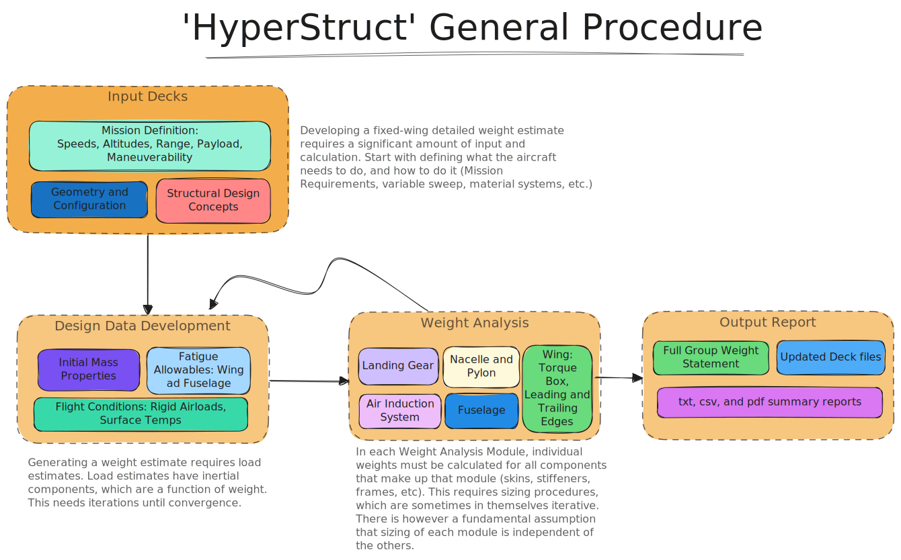
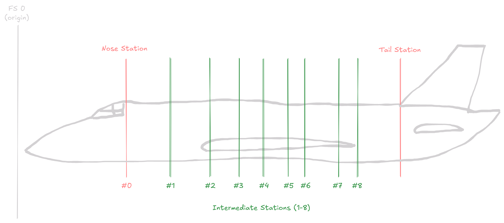

# Theory

This page outlines some of the basic theory behind hyperstruct. It will be updated and heavily expanded over time,
since all the methods are _extremely_ complicated.

As mentioned in the README page, HyperStruct is a modern implementation of the SWEEP software originally produced
by Rockwell International in 1974 {cite}`ascani_executive_1974`. The Structural Weight Estimation Program for Aircraft (SWEEP) was originally
implemented in FORTRAN. The source code for this program is no longer publicly available, but
the US Defence Technical Information Center has published all the original
documentation from Rockwell (which is extensive).

The basic idea boils down to something like this in it's simplest form:



## Fuselage

The fuselage structural components serve a wide range of functions. For the purposes of weight
estimating and accounting, these structural components are categorized as either basic or
secondary structure according to the definitions in MIL-STD-1374. The weight estimating
approach is based on calculating weights at the line item level of the detail weight
statement report form.

The program estimates basic structure weight by sizing structural members to strength,
stiffness, fatigue, and manufacturing requirements. These requirements are established
through the analysis of design criteria, engineering data, and vehicle geometry.
As such, there are a SIGNIFICANT number of inputs involved.

The approach to sizing shell structure (cover, minor frames, longerons or stringers)
is that of a multistation analysis. Bulkheads and major frames are sized to their
individual load requirements. The weights of these basic structure elements are
sensitive to factors such as geometry, type of construction, material properties,
temperature, loads (and loading criteria), acoustic fatigue, local panel flutter,
cutout size and location, stiffness requirements, and manufacturing limitations.

Secondary structure component weight are estimated by rule-of-thumb and empirical methods.
The weights of these items are sensitive to factors such as vehicle type and usage,
design criteria, specific item function, and dimensional data.

### Multistation Analysis

For multistation analysis: The external shell sectional geometry is represented as
a family of shapes (rounded rectangles). External geometry is described at the nose,
tail, and 8 intermediate stations. Shell structure is evaluated at a maximum of 19
synthesis cuts, for which geometry is determined by interpolation between the
described stations.



Stations are represented as their own base class within hyperstruct. You can find them
by importing directly! Stations can be arbitrarily assigned names, and "numbers." For
the fuselage, these numbers will simply be Fuselage Station measurements. Theoretically,
and not yet implemented, they are used for Wing and Tail stations as well.

Stations have geometrical parameters defining their cross-section. This geometry would
be representative of the OML at the location, and must be restricted to a circle, rounded
rectangle, or ellipse. All three of these shapes are generalized into 3 dimensions: width,
depth, and corner radius. By specifying the corner radius, you can acheive any of the three.

Stations are important, since they give the panel dimensions for Cover analysis. Panel
length is an evaluated arc length for 1 of 3 sectors: Upper, Lower, and Side (both sides are
sized equally).

## References

```{bibliography}

```
